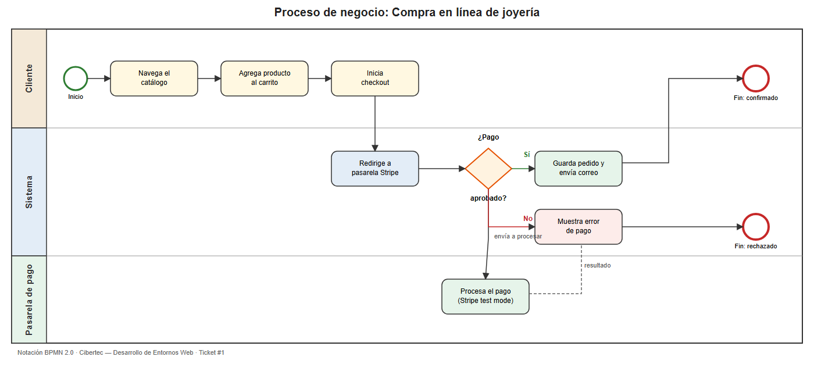

# Modelado de Procesos (BPMN)

Proceso de negocio: **Compra en línea de joyería**.

## Archivos incluidos

- [`proceso-compra.png`](proceso-compra.png) — diagrama exportado, listo para ver o imprimir.
- [`proceso-compra.svg`](proceso-compra.svg) — versión editable (vectorial) del mismo diagrama.

## Carriles

- **Cliente**: navega el catálogo, agrega un producto al carrito, inicia el checkout.
- **Sistema**: redirige a la pasarela de pago, evalúa el resultado del pago, guarda el pedido y envía el correo de confirmación (o muestra el error).
- **Pasarela de pago**: procesa el pago (Stripe, modo prueba).

## Compuerta de decisión

Después de que la pasarela procesa el pago, el sistema evalúa **¿Pago aprobado?**:

- **Sí** → se guarda el pedido y se envía el correo de confirmación → fin del proceso (confirmado).
- **No** → se muestra el error de pago al cliente → fin del proceso (rechazado).
