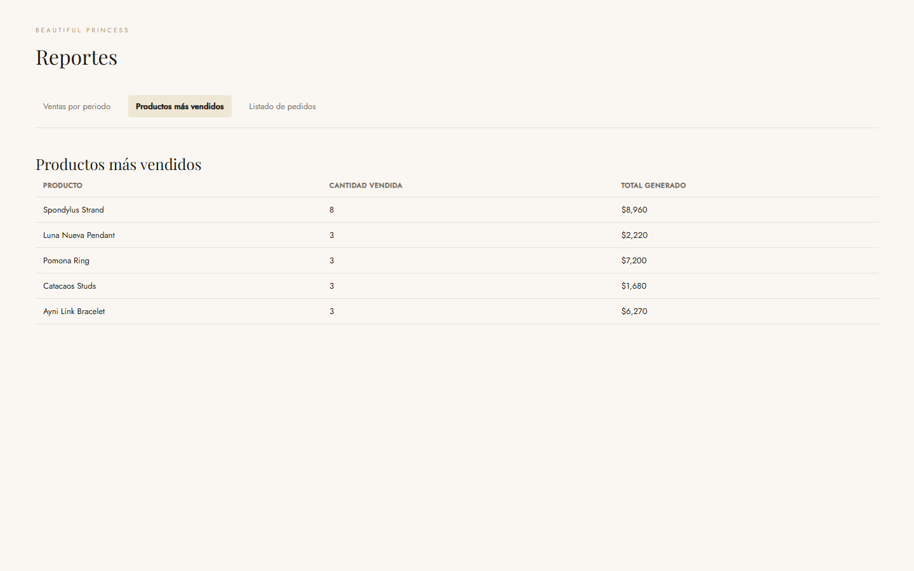
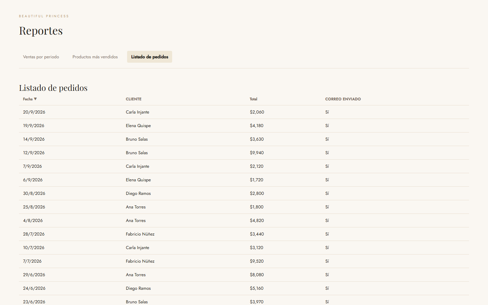

# Informe de Proyecto — Beautiful Princess

**Plan de Proyecto Productivo (EFSRT)**
**Carrera:** Computación e Informática — **Facultad:** Tecnología de la Información
**Curso:** Desarrollo de Entornos Web — **Grado:** Profesional Técnico — **Semestre:** 2026

## Carátula

| Campo                 | Detalle                                                   |
| --------------------- | --------------------------------------------------------- |
| Nombre del proyecto   | Beautiful Princess — Tienda en línea de joyería artesanal |
| Nombre del curso      | Desarrollo de Entornos Web (EFSRT)                        |
| Docente-monitor       | Napoleón Stein Cerna Rosas                                |
| Ciclo y semestre      | 2026                                                      |
| Coordinador del grupo | Jerson Marcial Vilca Puma                                 |
| Integrantes del grupo | Grupo número 1 — ver tabla siguiente                      |

| N°  | Nombres y apellidos          | Código | Rol en el equipo |
| --- | ---------------------------- | ------ | ---------------- |
| 1   | Jerson Marcial Vilca Puma    |        | Coordinador      |
| 2   | Leslie Denisse Arias Alcalá  |        |                  |
| 3   | Ylan Cleiver Cardozo Gonzales|        |                  |
| 4   | Joy Carolin Narro Garcia     |        |                  |

## Introducción

El presente informe describe el proyecto **Beautiful Princess**, una tienda en
línea de joyería artesanal. El diagnóstico partió de la situación de un
emprendimiento de joyería hecha a mano en el Perú que atendía a sus clientes de
forma presencial, sin un canal digital que permita vender, cobrar y confirmar
pedidos de manera automática.

Se plantearon como objetivos implementar un catálogo en línea, automatizar el
flujo de compra con pago por tarjeta (en modalidad de demostración) y mostrar
reportes administrativos de ventas. El impacto esperado es ampliar el alcance
del negocio, reducir la dependencia de la atención presencial y dar al cliente
una experiencia de compra segura, trazable y disponible las 24 horas.

Para su desarrollo se aplicó la metodología ágil **Scrum**, trabajando por
entregas (sprints) gestionadas como _issues_ y _pull requests_ en el repositorio
del proyecto.

## Capítulo I — Diagnóstico del Problema

### 1.1 Diagnóstico Situacional

**Beautiful Princess** es un emprendimiento de joyería artesanal que elabora
piezas de oro 18k, plata y piedras de la región. Su proceso de venta actual es
presencial y manual: el cliente debe asistir al local o coordinar por redes
sociales, el cobro se realiza fuera de línea y no existe un registro automático
del pedido. Esta situación limita el crecimiento del negocio y genera fricción
en la experiencia de compra.

El análisis del entorno se desarrolla con la metodología **SEPTE** (Social,
Económico, Político, Tecnológico y Ecológico):

| Dimensión       | Situación del entorno                                                                                                 | Evidencia                                                |
| --------------- | --------------------------------------------------------------------------------------------------------------------- | -------------------------------------------------------- |
| **Social**      | Los clientes valoran el consumo de productos artesanales locales y compran cada vez más por medios digitales.         | Tendencia de compra en línea de artesanías y accesorios. |
| **Económico**   | El comercio electrónico sigue creciendo; una tienda física limita el alcance y el horario de venta.                   | Crecimiento sostenido del comercio electrónico.          |
| **Político**    | Existen normas de protección al consumidor y de comercio electrónico que exigen transacciones seguras y comprobables. | Regulación vigente aplicable al comercio en línea.       |
| **Tecnológico** | Las pasarelas de pago (Stripe) y el despliegue en la nube (Vercel) permiten montar una tienda robusta con bajo costo. | Uso real de Stripe y Vercel en el proyecto.              |
| **Ecológico**   | La artesanía usa materiales y técnicas de la región; la venta en línea reduce desplazamientos.                        | Piezas elaboradas con materiales de la región.           |

**Datos estadísticos del proyecto** (obtenidos del repositorio):

| Métrica                          | Valor |
| -------------------------------- | ----- |
| Sprints (hitos)                  | 5     |
| Issues cerradas vía pull request | 16    |
| Pull requests fusionados         | 15    |
| Pruebas automatizadas (Vitest)   | 24    |
| Pruebas en verde                 | 24    |
| Pedidos de prueba generados      | 15    |
| Productos en el catálogo         | 24    |
| Colecciones                      | 4     |

### 1.2 Justificación del Proyecto

El proyecto es aplicable porque resuelve una necesidad concreta del
emprendimiento y genera impacto en tres niveles:

- **En el negocio (empresas):** incorpora un canal de venta en línea con cobro
  automatizado y confirmación por correo, eliminando la dependencia de la
  atención presencial y dejando un registro trazable de cada pedido.
- **En las personas:** el cliente puede comprar en cualquier momento, con una
  pasarela de pago segura y la garantía de recibir la confirmación de su pedido
  por correo.
- **En la sociedad:** visibiliza la producción artesanal peruana y prepara al
  equipo en metodologías ágiles, pruebas y despliegue en la nube, competencias
  demandadas por el mercado laboral.

## Capítulo II — Descripción del Proyecto

### 2.1 Objetivos del Proyecto

Los objetivos cumplen los criterios **SMART** (Específicos, Medibles,
Alcanzables, Relevantes y a Tiempo):

**OBJ 1.** Implementar un catálogo en línea que permita explorar las 24 piezas
del catálogo, organizadas en 4 colecciones (anillos, collares, aretes y
pulseras), con su nombre, material, imagen y precio, para el semestre 2026-2.

**OBJ 2.** Automatizar el flujo de compra —carrito, checkout con datos de
contacto, pago con tarjeta en modalidad demostración y confirmación por
correo— de modo que el pedido quede registrado de forma automática, verificable
con 24 pruebas automatizadas en verde.

**OBJ 3.** Desarrollar un módulo de reportes con tres vistas administrativas
(ventas por periodo, productos más vendidos y listado de pedidos ordenable),
accesible desde una única sección, para el semestre 2026-2.

### 2.2 Alcance

**Qué incluye el proyecto:**

- Catálogo de productos con colecciones, detalle de cada pieza y botón para
  agregarla al carrito.
- Carrito de compras persistente en el navegador, con edición de cantidades y
  total automático.
- Checkout con nombre y correo, pago por tarjeta vía **Stripe** (modo
  demostración) y pantalla de confirmación con número de pedido.
- Envío automático de correo de confirmación al registrar el pedido.
- Módulo administrativo con **ventas por periodo**, **productos más vendidos**
  y **listado de pedidos** ordenable.
- Manual de usuario y guía de instalación documentados.

**Qué queda fuera del alcance:**

- Cobros reales en producción (el pago funciona en modo demostración).
- Gestión de inventario y logística de envíos.
- Autenticación y roles de usuario en el área administrativa.
- Aplicación móvil nativa.
- Integración con sistemas contables o ERP.

### 2.3 Ubicación

El proyecto se implementa para el emprendimiento **Beautiful Princess**, que
opera en el **área comercial / ventas en línea** de la organización. El
desarrollo se realizó de forma distribuida por un equipo de cuatro estudiantes,
con el código administrado en el repositorio `Carolin26/07_beautifulPrincess`
y la aplicación desplegada en `https://joyeria-eight.vercel.app`.

### 2.4 Beneficiarios directos e indirectos

- **Beneficiarios directos:** la dueña y artesana del emprendimiento (nuevo
  canal de venta), los clientes que compran en línea (experiencia segura y
  trazable) y el equipo de desarrollo (competencias técnicas).
- **Beneficiarios indirectos:** proveedores de materiales, la comunidad de
  artesanos de la zona y el ecosistema de comercio electrónico local.

**Modelo Canvas — Propuesta de valor:**

| Bloque                | Descripción                                                                                              |
| --------------------- | -------------------------------------------------------------------------------------------------------- |
| Socios clave          | Artesanos proveedores, pasarela de pago (Stripe), plataforma de despliegue (Vercel), servicio de correo. |
| Actividades clave     | Diseño de piezas, catálogo, gestión de pedidos, generación de reportes.                                  |
| Recursos clave        | Tienda en línea, datos de catálogo y pedidos, repositorio y flujo de CI.                                 |
| Propuesta de valor    | Joyería artesanal peruana con compra en línea segura, sencilla y confirmada por correo.                  |
| Relación con clientes | Atención por correo y redes, confirmación automática de cada pedido.                                     |
| Canales               | Sitio web, correo electrónico, redes sociales.                                                           |
| Segmento de clientes  | Clientes que valoran joyería artesanal y compra por internet.                                            |
| Estructura de costos  | Materiales, dominio y hospedaje, herramientas de desarrollo y pago.                                      |
| Fuentes de ingresos   | Venta de joyas; a futuro, personalización y envíos.                                                      |

## Capítulo III — Planificación y entregables

### 3.1 Cronograma (Gantt)

El proyecto se ejecutó en 5 sprints (hitos), cada uno con sus entregables:

| Actividad / Hito                  | Sem 1 | Sem 2 | Sem 3 | Sem 4 | Sem 5 | Sem 6 | Sem 7 |
| --------------------------------- | ----- | ----- | ----- | ----- | ----- | ----- | ----- |
| Modelado (BPMN + modelo de datos) | ████  | ████  |       |       |       |       |       |
| Persistencia plana (JSON + seed)  |       | ███   | ████  |       |       |       |       |
| Consultas (ordenar, agregaciones) |       |       | ███   | ████  |       |       |       |
| Reportes en línea                 |       |       |       | ████  | ████  | ███   |       |
| Documentación de entrega          |       |       |       |       | ███   | ████  | ███   |
| Presentación final (entrega 100%) |       |       |       |       |       |       | ████  |

Las actividades se realizaron en paralelo por los integrantes del equipo usando
_issues_ y _pull requests_ como unidades de trabajo dentro del proceso Scrum.

### 3.2 Productos y entregables

**Diagrama de procesos (BPMN).** Proceso de negocio "Compra en línea de
joyería", modelado en Bizagi con 4 carriles (Cliente, Sistema, Pasarela de
pago y Servicio de correo):

**Modelo de datos.** Modelo entidad-relación con 5 entidades (Colección,
Producto, Cliente, Pedido y DetallePedido), documentado junto con la estrategia
de persistencia en JSON:

**Vistas de reportes.** Las 3 vistas requeridas por el enunciado, funcionando
con datos de prueba:

**Justificación del stack.** El proyecto usa React 19 + Vite. Como el temario
pide aplicar "HTML5 + CSS3 + JS", se justificó formalmente que el JSX se
transpila a HTML5 y JavaScript estándar, que el build de producción genera un
`index.html`, un `.js` y un `.css` (los tres archivos que pide el enunciado) y
que no se usó ningún framework de CSS (todo es CSS3 con variables nativas). El
detalle completo está en `docs/justificacion-stack.md`.

## Conclusiones

1. La tienda en línea cumplió el flujo de compra completo de punta a punta:
   catálogo, carrito, checkout, pago en modo demostración y confirmación por
   correo, validado en el sitio desplegado y respaldado por 24 pruebas
   automatizadas en verde.
2. El módulo de reportes permitió transformar los datos planos (JSON de
   pedidos) en información útil para la toma de decisiones: ventas por periodo,
   productos más vendidos y listado ordenable de pedidos.
3. Aplicar el flujo ágil con _issues_ y _pull requests_ y la integración
   continua (lint, formato, pruebas y build en cada PR) permitió entregar el
   proyecto completo, con documentación (BPMN, modelo de datos, justificación
   de stack, manual de usuario) integrada en un solo repositorio.

## Recomendaciones

1. Al pasar a producción real, activar los cobros reales de Stripe y agregar
   autenticación y roles en el área administrativa.
2. Migrar la persistencia actual (JSON) a una base de datos relacional cuando
   el volumen de pedidos lo exija, usando el modelo entidad-relación ya
   documentado.
3. Para proyectos similares, mantener la documentación (BPMN, modelo de datos y
   manuales) junto al código en el mismo repositorio, como se hizo aquí, para
   que siempre esté sincronizada con la implementación.

## Glosario

| Término          | Definición                                                                                       |
| ---------------- | ------------------------------------------------------------------------------------------------ |
| SEPT             | Análisis del entorno en cinco dimensiones: Social, Económico, Político, Tecnológico y Ecológico. |
| BPMN             | Notación estándar para modelar procesos de negocio (diagramas de flujo).                         |
| Entidad-relación | Modelo conceptual que representa entidades, atributos y relaciones de los datos.                 |
| SMART            | Criterios de objetivos: Específicos, Medibles, Alcanzables, Relevantes y a Tiempo.               |
| Scrum            | Metodología ágil que organiza el trabajo en sprints o entregas cortas.                           |
| SPA              | Aplicación de una sola página ("single-page application") que navega sin recargar.               |
| Pasarela de pago | Servicio externo que procesa pagos con tarjeta (Stripe).                                         |
| `localStorage`   | Almacenamiento persistente en el navegador del cliente.                                          |
| CI               | Integración continua: ejecución automática de controles en cada cambio (GitHub Actions).         |
| Hito             | Entregable parcial que marca un avance dentro del cronograma del proyecto.                       |

## Bibliografía

- React — Biblioteca de interfaces: https://react.dev
- Vite — Herramienta de construcción: https://vitejs.dev
- Stripe — Documentación de pasarela de pago: https://docs.stripe.com
- Vercel — Plataforma de despliegue: https://vercel.com/docs
- Bizagi Modeler — Modelado de procesos: https://www.bizagi.com/es/plataforma/modeler
- Documentos del proyecto: `docs/bpmn/`, `docs/modelo-datos/`,
  `docs/justificacion-stack.md`, `docs/manual-usuario.md`.

## Anexos

- Diagrama BPMN editable: `docs/bpmn/proceso-compra.bpm`.
- Modelo entidad-relación editable: `docs/modelo-datos/modelo-entidad-relacion.svg`
  y `docs/modelo-datos/er.dbml`.
- Modelo de datos detallado: `docs/modelo-datos/esquema.md`.
- Manual de usuario para el cliente final: `docs/manual-usuario.md`.
- Datos de prueba y sembrado: `data/` y `scripts/seed.js`.
- Flujo de integración continua: `.github/workflows/ci.yml`.
