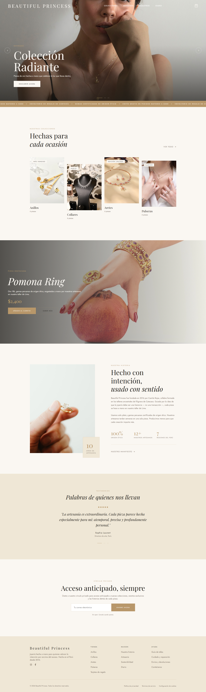
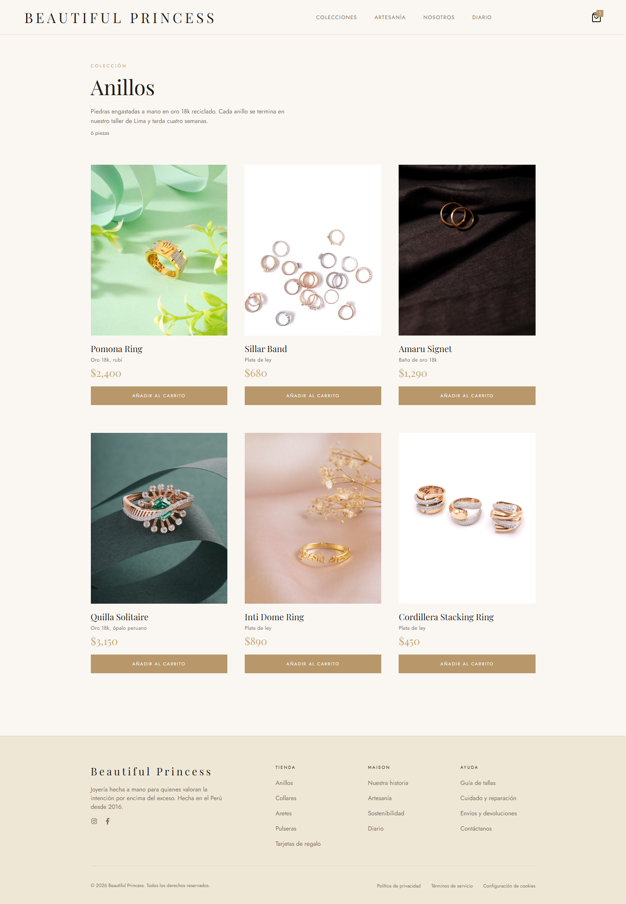
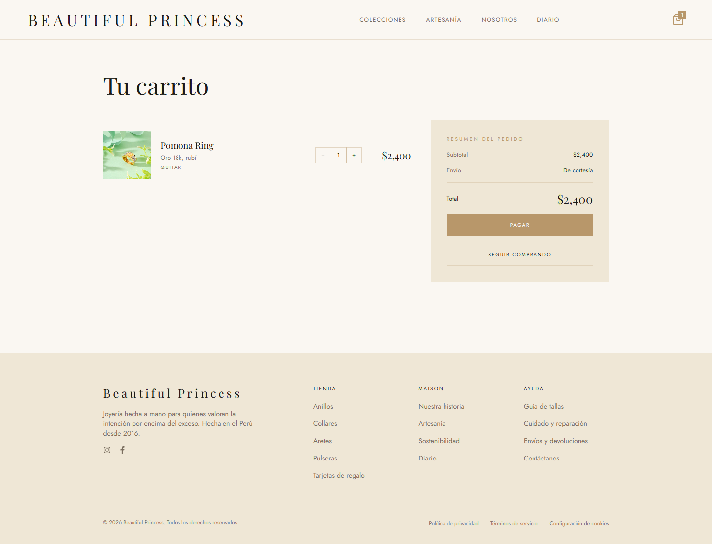
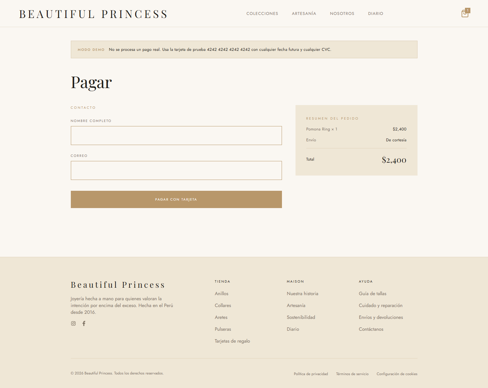
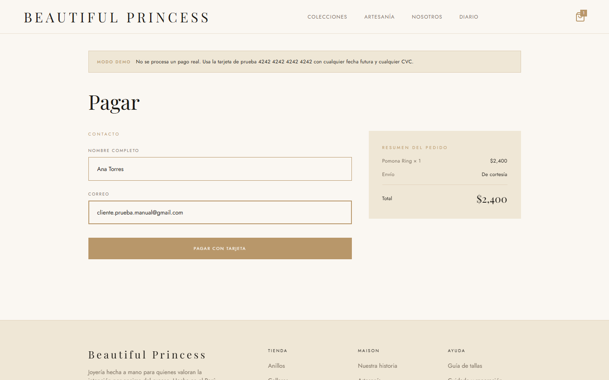
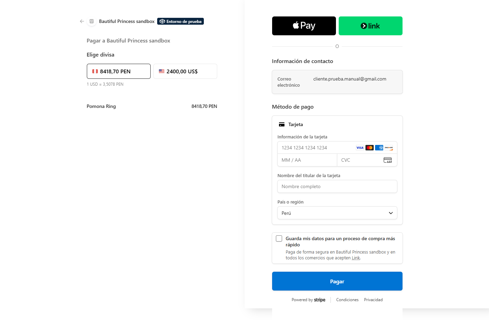
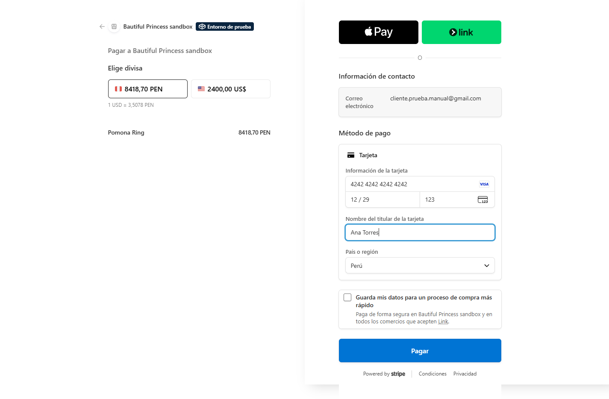
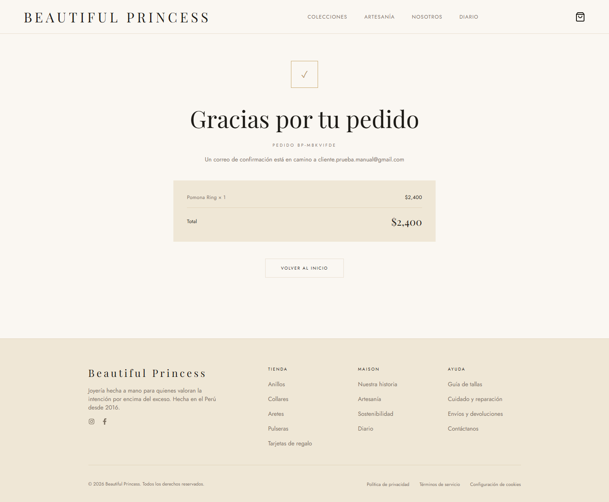

# Manual de usuario — Beautiful Princess

Guía paso a paso para comprar en nuestra tienda en línea. Está escrita para
cualquier persona, sin necesidad de conocimientos técnicos.

> La tienda funciona en **modo demostración**: el pago es simulado, no se usa
> ningún dinero real.

## 1. Entrar a la tienda

Abre tu navegador y visita:

```
https://joyeria-eight.vercel.app
```

Verás la página principal con nuestras colecciones: Anillos, Collares, Aretes
y Pulseras.



## 2. Elegir una colección

Entra a una colección haciendo clic en su tarjeta (por ejemplo, **Anillos**).
Ahí verás todas las piezas de esa colección, con su nombre, material y precio.


## 3. Agregar una pieza al carrito

Cada pieza tiene un botón **Añadir al carrito**. Al hacer clic, la pieza queda
guardada en tu carrito.



## 4. Revisar tu carrito

Con el ícono de la bolsa, arriba a la derecha, entras a tu carrito. Ahí puedes:

- Ver cada pieza que elegiste con su foto, nombre y precio.
- Cambiar la cantidad con los botones **+** y **−**.
- Quitar una pieza con **Quitar**.
- Ver el **total** de tu pedido.



Cuando estés listo, presiona **Pagar**.

## 5. Completar tus datos

En la página de pago escribe tu **nombre completo** y tu **correo electrónico**.
Revisa el resumen de tu pedido (piezas, envío y total) y presiona
**Pagar con tarjeta**.





## 6. Pagar con tu tarjeta

Serás llevado a la página de pago seguro. Ingresa los datos de tu tarjeta y
presiona **Pagar**.

Como la tienda está en modo demostración, usa esta tarjeta de prueba:

| Dato              | Valor                  |
| ----------------- | ---------------------- |
| Número            | `4242 4242 4242 4242`  |
| Fecha vencimiento | cualquier fecha futura |
| CVC               | cualquier (3 cifras)   |





## 7. Confirmación del pedido

Al terminar el pago verás una pantalla de **Gracias por tu pedido** con:

- Tu **número de pedido**.
- Un aviso de que el correo de confirmación está en camino a tu correo.
- El resumen con las piezas compradas y el total.



Revisa tu correo: recibirás el detalle de tu compra para guardarlo como
comprobante.

¡Listo! Tu pedido quedó registrado.
