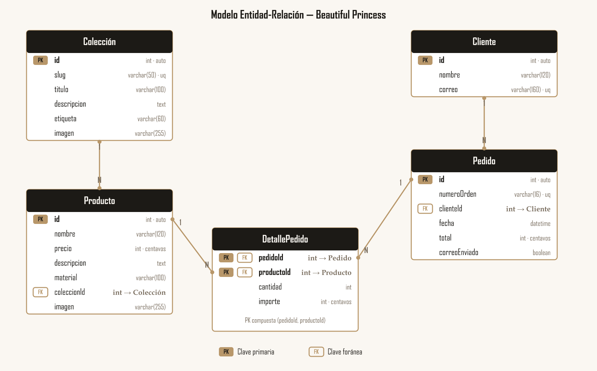

# Modelo Entidad-Relación

Modelo de datos de **Beautiful Princess**, utilizado para representar la información principal del catálogo y del proceso de compra de la tienda en línea de joyería.

## Archivos incluidos

* [`modelo-entidad-relacion.png`](modelo-entidad-relacion.png) — diagrama del modelo.
* [`modelo-entidad-relacion.svg`](modelo-entidad-relacion.svg) — versión vectorial editable del diagrama.
* [`er.dbml`](er.dbml) — archivo fuente del modelo.

## Entidades

El modelo está compuesto por cinco entidades: **Colección, Producto, Cliente, Pedido y DetallePedido**.

### Colección

Representa las colecciones en las que se organizan los productos del catálogo. Contiene la información necesaria para identificar y mostrar cada colección, como su nombre, descripción, etiqueta e imagen.

| Campo         | Tipo           | Restricción | Descripción                       |
| ------------- | -------------- | ----------- | --------------------------------- |
| `id`          | `int`          | **PK**      | Identificador de la colección     |
| `slug`        | `varchar(50)`  | `UNIQUE`    | Identificador utilizado en la URL |
| `titulo`      | `varchar(100)` | `NOT NULL`  | Nombre de la colección            |
| `descripcion` | `text`         |             | Descripción de la colección       |
| `etiqueta`    | `varchar(60)`  |             | Etiqueta asociada a la colección  |
| `imagen`      | `varchar(255)` | `NOT NULL`  | Ruta o URL de la imagen           |

### Producto

Representa cada pieza disponible en el catálogo. Se relaciona con una colección y contiene información como nombre, precio, descripción, material e imagen.

| Campo         | Tipo           | Restricción | Descripción                 |
| ------------- | -------------- | ----------- | --------------------------- |
| `id`          | `int`          | **PK**      | Identificador del producto  |
| `nombre`      | `varchar(120)` | `NOT NULL`  | Nombre del producto         |
| `precio`      | `int`          | `NOT NULL`  | Precio del producto         |
| `descripcion` | `text`         |             | Descripción del producto    |
| `material`    | `varchar(100)` |             | Material del producto       |
| `coleccionId` | `int`          | **FK**      | Referencia a `Coleccion.id` |
| `imagen`      | `varchar(255)` | `NOT NULL`  | Ruta o URL de la imagen     |

### Cliente

Representa a la persona que realiza una compra. Se registran sus datos básicos para asociarlos al pedido y permitir la comunicación relacionada con la compra.

| Campo    | Tipo           | Restricción | Descripción                    |
| -------- | -------------- | ----------- | ------------------------------ |
| `id`     | `int`          | **PK**      | Identificador del cliente      |
| `nombre` | `varchar(120)` | `NOT NULL`  | Nombre del cliente             |
| `correo` | `varchar(160)` | `NOT NULL`  | Correo electrónico del cliente |

### Pedido

Representa una orden de compra realizada por un cliente. Permite identificar el pedido, relacionarlo con el cliente y registrar información como la fecha y el total de la compra.

| Campo         | Tipo          | Restricción          | Descripción               |
| ------------- | ------------- | -------------------- | ------------------------- |
| `id`          | `int`         | **PK**               | Identificador del pedido  |
| `numeroOrden` | `varchar(16)` | `NOT NULL`, `UNIQUE` | Número de orden           |
| `clienteId`   | `int`         | **FK**               | Referencia a `Cliente.id` |
| `fecha`       | `datetime`    | `NOT NULL`           | Fecha y hora del pedido   |
| `total`       | `int`         | `NOT NULL`           | Total del pedido          |

### DetallePedido

Representa cada producto incluido dentro de un pedido. Permite registrar qué producto se compró, la cantidad solicitada y el importe correspondiente.

| Campo        | Tipo  | Restricción | Descripción                |
| ------------ | ----- | ----------- | -------------------------- |
| `pedidoId`   | `int` | **PK, FK**  | Referencia a `Pedido.id`   |
| `productoId` | `int` | **PK, FK**  | Referencia a `Producto.id` |
| `cantidad`   | `int` | `NOT NULL`  | Cantidad de unidades       |
| `importe`    | `int` | `NOT NULL`  | Importe de la línea        |

La clave primaria de `DetallePedido` está formada por la combinación de `pedidoId` y `productoId`.

## Relaciones entre las entidades

Las entidades se relacionan de la siguiente manera:

* Una **Colección** puede tener varios **Productos**, mientras que cada producto pertenece a una colección.
* Un **Cliente** puede realizar varios **Pedidos**, mientras que cada pedido corresponde a un cliente.
* Un **Pedido** puede contener varios registros de **DetallePedido**.
* Un **Producto** puede aparecer en diferentes detalles de pedido.

Estas relaciones permiten representar el recorrido de una compra desde los productos del catálogo hasta el pedido realizado por el cliente.

## Correspondencia con los datos del proyecto

Los campos del modelo mantienen correspondencia con las estructuras de datos utilizadas en el proyecto. De esta manera, el modelo representa la información que utiliza actualmente la aplicación.

| Entidad       | Campos principales                                                           | Ubicación                          |
| ------------- | ---------------------------------------------------------------------------- | ---------------------------------- |
| Colección     | `id`, `slug`, `titulo`, `descripcion`, `etiqueta`, `imagen`                  | `src/data/colecciones.js`          |
| Producto      | `id`, `nombre`, `precio`, `descripcion`, `material`, `coleccionId`, `imagen` | `shared/catalogo.js`               |
| Cliente       | `nombre`, `correo`                                                           | Formulario de Checkout             |
| Pedido        | `numeroOrden`, `clienteId`, `fecha`, `total`                                 | Proceso de confirmación del pedido |
| DetallePedido | `productoId`, `cantidad`, `importe`                                          | Detalle de la compra               |

## Estrategia de persistencia

Para este proyecto se eligió utilizar archivos JSON estructurados ya que esta opción se adapta al alcance actual de la aplicación, puesto que los datos del catálogo son información que la aplicación necesita consultar y mostrar, como las colecciones, productos, precios, imágenes y descripciones.

El formato JSON permite organizar estos datos mediante objetos y arreglos, manteniendo una estructura clara que puede ser utilizada directamente por la aplicación. Además, facilita la edición y revisión de la información durante el desarrollo, sin requerir la configuración, conexión y administración de un motor de base de datos.

Por otro lado, el modelo entidad-relación permite definir desde esta etapa las entidades, campos, claves y relaciones que tendría una futura base de datos. De esta manera, el uso de JSON no impide documentar la estructura de los datos ni establecer su organización. De acuerdo con el alcance del proyecto, el modelo puede quedar documentado sin que sea obligatorio realizar su migración a SQLite o a otro motor de base de datos.
